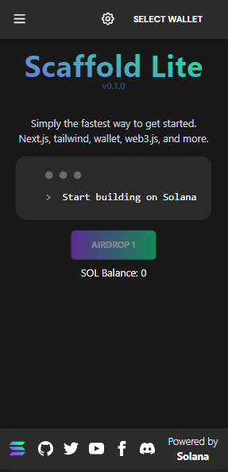
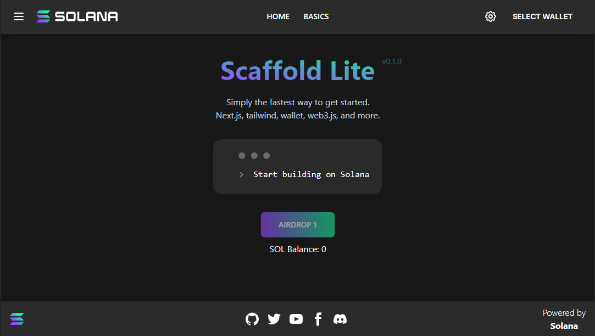

# Solana dApp Scaffold Next

The Solana dApp Scaffold repos are meant to house good starting scaffolds for ecosystem developers to get up and running quickly with a front end client UI that integrates several common features found in dApps with some basic usage examples. Wallet Integration. State management. Components examples. Notifications. Setup recommendations.

Responsive                     |  Desktop
:-------------------------:|:-------------------------:
  |  